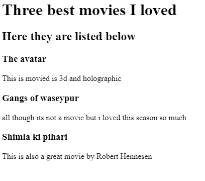
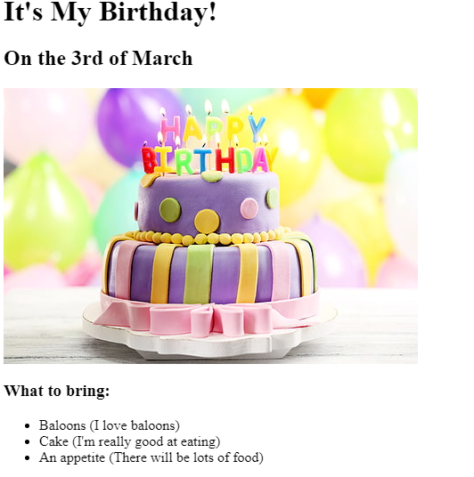

<!DOCTYPE html>
<html lang="en">
    <head>
        <meta charset="UTF-8">
        <meta name="viewport" content="width=device-width, initial-scale=1.0">
        <title>First porfolio</title>
    </head>
    <body>
        <h1>I am Muhammad Talha</h1>
        <h2>Beginner Developer</h2>
        

        <h3><a href="./index1.html">My Favourite Movies</a></h3>
        
        <h3><a href="./birthday1.html">Birthday Invitation</a></h3>
        
        

        <h3><a href="./contact.html">Contact Me</a></h3>
    </body>
</html>
